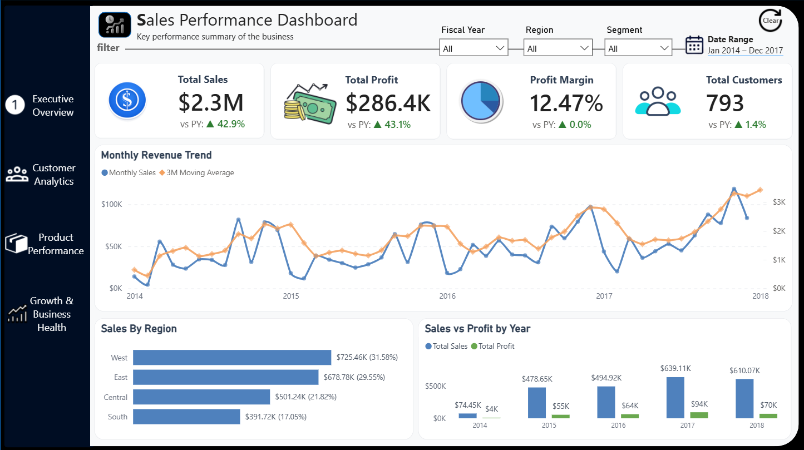
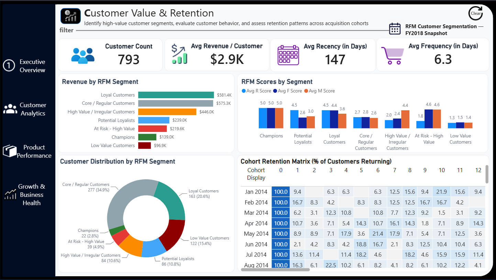
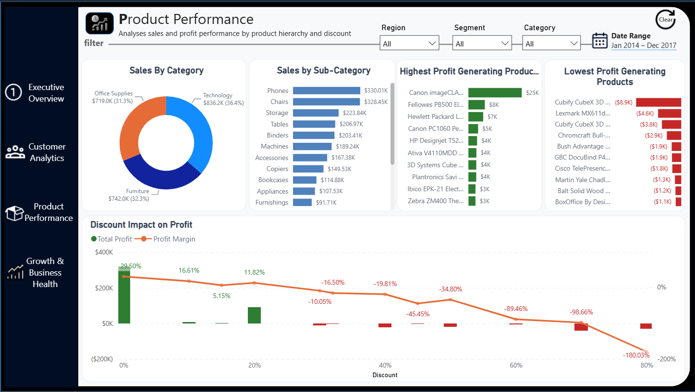
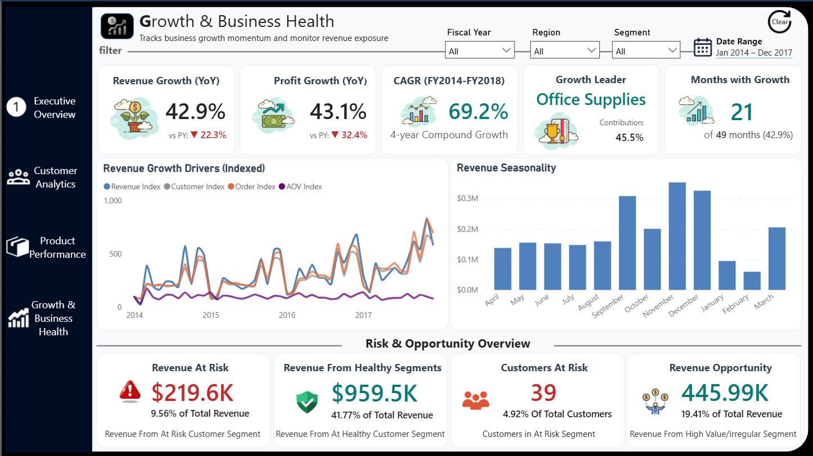

# Advanced Sales Analytics

[](https://www.python.org/)
[](https://pandas.pydata.org/)
[](https://www.microsoft.com/sql-server)
[](https://powerbi.microsoft.com/)
[](LICENSE)

An end-to-end sales analytics project built with **Python, SQL Server, and Power BI**.

Originally developed as a foundational sales analysis project, V2 expands the solution into a structured analytical workflow covering **business performance, customer behavior, retention, profitability, growth, risk, and revenue opportunity**.

The repository contains both iterations:

* **V1 — Sales Performance & Growth Analysis:** foundational sales analysis and reporting
* **V2 — Advanced Sales Analytics:** redesigned analytical architecture with deeper customer, growth, retention, profitability, and business-health analysis

The evolution from V1 to V2 demonstrates how an analytical project can develop from basic reporting into a more structured and reusable business analytics solution.

---

## ✅ Project Status

**V2 — Completed**

The current version includes the full Python → SQL Server → Power BI workflow, four analytical report pages, interactive navigation, custom tooltips, dynamic data-range indicators, and technical documentation covering major architectural and implementation decisions.

---

## 🚀 What Changed in V2?

V2 was developed as an intentional extension of the original project rather than a separate analysis.

The main improvements include:

* Python-based data preparation before SQL ingestion
* Structured SQL staging and analytical layers
* Dedicated calendar dimension with fiscal-year support
* RFM customer segmentation
* Cohort retention analysis
* Growth-driver decomposition
* CAGR and seasonality analysis
* Discount and profitability analysis
* Revenue-at-risk and revenue-opportunity metrics
* Multi-page Power BI reporting
* Bookmark-based navigation
* Context-aware report-page tooltips
* Dynamic data-range visibility
* Separate technical documentation explaining architectural and implementation decisions

V1 remains in the repository to demonstrate the progression from the original implementation to V2.

---

## 🎯 Project Objective

The goal of this project is to transform raw transactional sales data into a structured analytical solution that can be used to:

* Evaluate overall business performance
* Identify sales and profitability drivers
* Analyze customer behavior and retention
* Measure business growth and momentum
* Identify revenue at risk and revenue opportunities
* Investigate the relationship between discounting and profitability
* Provide interactive dashboards for business exploration

The purpose is not simply to produce a dashboard.

The broader objective is to demonstrate an end-to-end analytical workflow:

**Prepare → Model → Analyze → Visualize → Interpret → Recommend**

The project demonstrates how transactional data can be transformed into a reusable analytical solution that supports both **business performance monitoring** and **deeper diagnostic analysis**.

---

# 🔄 Project Evolution

This project represents an intentional progression from a basic analytical dashboard toward a more complete analytics solution.

| Area                 | V1                 | V2                                    |
| -------------------- | ------------------ | ------------------------------------- |
| Data preparation     | Basic              | Python-based preparation              |
| SQL                  | Core analysis      | Structured analytical layer           |
| Calendar             | Basic              | Fiscal-year/time-intelligence support |
| Customer analysis    | Basic segmentation | RFM + cohort retention                |
| Product analysis     | Sales-focused      | Profitability + discount analysis     |
| Growth analysis      | Basic YoY          | Growth drivers + CAGR + seasonality   |
| Risk analysis        | —                  | Revenue and customer risk             |
| Opportunity analysis | —                  | Revenue opportunity                   |
| Power BI             | Core dashboard     | Multi-page interactive report         |
| Navigation           | Basic              | Bookmark-based navigation             |
| Tooltips             | Basic              | Custom analytical tooltips            |
| Documentation        | README             | README + technical decision breakdown |

---

# 📊 Dataset

* **Source:** Superstore Sales Dataset
* **Order-line records:** 9,994
* **Unique Customers:** 793
* **Date range:** January 2014 – December 2017
* **Grain:** Order-line level
* **Primary analytical fields:**

  * Sales
  * Profit
  * Quantity
  * Discount
  * Region
  * Segment
  * Category
  * Sub-Category
  * Product
  * Customer
  * Order Date
  * Ship Date

The dataset contains transactional order-line data, which makes the definition of analytical grain important when calculating customer, order, and product-level metrics.

The report uses fiscal-year analysis, with the final fiscal period only partially represented because the source data ends in December 2017.

The dataset is used for educational and portfolio purposes.

---

# 🏗️ Project Architecture

V2 separates the project into distinct analytical layers:

```text
Raw Superstore Dataset
        │
        ▼
┌─────────────────────┐
│ Python              │
│ Data Preparation    │
│ & CSV Validation    │
└─────────┬───────────┘
          │
          ▼
┌─────────────────────┐
│ SQL Server          │
│                     │
│ Staging             │
│        ↓            │
│ Fact / Dimensions   │
│        ↓            │
│ Analytical Views    │
└─────────┬───────────┘
          │
          ▼
┌─────────────────────┐
│ Power BI            │
│                     │
│ Data Model + DAX    │
│        ↓            │
│ Interactive Reports │
└─────────────────────┘
```

This separation keeps **data preparation, analytical modeling, and visualization responsibilities distinct**, making the solution easier to maintain and extend.

---

# 🧹 Data Preparation

## Initial Cleaning

The original dataset required preparation before being used for analytical modeling.

Cleaning activities included:

* Removing duplicate records where appropriate
* Standardizing column names
* Validating numeric fields
* Checking missing values
* Reviewing date fields
* Investigating problematic text fields

## Python Data Preparation

Python and pandas were used to prepare the dataset for reliable SQL Server ingestion.

Key steps included:

* Standardizing date formats
* Handling embedded quotation marks in product names
* Preserving numeric values
* Maintaining consistent column ordering
* Exporting a UTF-8 encoded CSV
* Preparing the dataset for SQL Server bulk loading

The Python layer is intentionally kept separate from the analytical SQL layer so that data preparation and business modeling remain distinct responsibilities.

---

# 🗃️ SQL Server

SQL Server acts as the central analytical data layer.

## Staging

A staging table is used to safely ingest the cleaned source data before populating the analytical tables.

This separates:

**raw ingestion → validation/transformation → analytical data**

and reduces the risk of source-data issues affecting the final model.

### Fact Table

The main transactional fact table retains the order-line grain of the source data.

This grain is important when analyzing:

* Sales
* Profit
* Quantity
* Discount
* Products
* Orders

### Calendar Dimension

A dedicated calendar dimension supports:

* Year analysis
* Month analysis
* Fiscal year analysis
* Year-over-year comparisons
* Month-over-month analysis
* Time-series calculations
* Cohort analysis

Using a dedicated calendar dimension also allows Power BI time-intelligence calculations to operate consistently across the report.

## Analytical Views

Reusable SQL views were created to separate analytical logic from the underlying transactional tables.

The analytical layer includes views supporting:

* Customer overview
* RFM analysis
* Revenue analysis
* Risk analysis
* Customer and cohort analysis

This allows Power BI to consume reusable analytical structures rather than embedding all business logic directly into individual visuals.

---

# 👥 Customer Analytics

V2 introduces customer-level analysis using **RFM methodology**.

RFM evaluates customers across three dimensions:

| Metric    | Meaning                                 |
| --------- | --------------------------------------- |
| Recency   | How recently the customer purchased     |
| Frequency | How frequently the customer purchased   |
| Monetary  | How much revenue the customer generated |

Customers are scored and grouped into behavioral segments.

### RFM Segments

The final segmentation includes:

* Champions
* Loyal Customers
* Potential Loyalists
* Core / Regular Customers
* High Value / Irregular Customers
* At Risk - High Value
* Low Value Customers

This allows the analysis to move beyond simply asking **"How much did each customer spend?"** and instead examine customer value and behavior.

---

# 🔁 Cohort Retention Analysis

Cohort analysis groups customers according to the month of their first purchase and tracks their subsequent purchasing activity relative to that first-purchase month.

The cohort matrix allows retention to be examined by:

* Customer cohort
* Months since first purchase
* Cohort size
* Returning customers
* Retention rate

This provides a different perspective from RFM.

While RFM describes **customer value and behavior**, cohort analysis examines **customer retention over time**.

---

# 📈 Growth & Time-Series Analysis

V2 expands the original time-series analysis considerably.

The project includes:

* Monthly sales trends
* 3-month moving average
* Month-over-month growth
* Year-over-year growth
* Profit growth
* CAGR (FY2014-FY2018)
* Months with positive growth
* Revenue growth drivers
* Revenue seasonality

### CAGR

CAGR is calculated from FY2014 through FY2018 using the available data. 
Because FY2018 is only partially represented in the dataset, this should 
not be interpreted as a comparison of four complete fiscal years. It instead 
represents growth across the available fiscal-year periods.

### Revenue Growth Drivers

Revenue growth is further decomposed using indexed measures for:

* Customer count
* Order count
* Average order value (AOV)
* Revenue

This helps identify whether revenue growth is primarily driven by changes in customer volume, order volume, average order value, or a combination of factors.

---

# 📦 Product & Profitability Analysis

The Product Performance page examines sales and profitability across the product hierarchy.

Analysis includes:

* Sales by category
* Sales by sub-category
* Highest profit-generating products
* Lowest profit-generating products
* Discount impact on profit
* Profit margin by discount level

The discount analysis is particularly useful for identifying situations where increased discounting is associated with declining profitability.

---

# ⚠️ Risk & Opportunity Analysis

V2 introduces a business-health layer that connects customer segmentation with revenue exposure.

These metrics are segmentation-based indicators rather than predictive churn models.

### Revenue At Risk

Revenue associated with the **At Risk - High Value** customer segment.

This is a segmentation-based indicator of revenue exposure and should not be interpreted as predicted churn revenue.

### Revenue From Healthy Segments

Revenue generated by customer segments considered healthier from a value and engagement perspective.

This provides context for how much revenue is currently supported by stronger customer relationships.

### Customers At Risk

The number of customers classified as **At Risk - High Value**.

### Revenue Opportunity

Revenue associated with the **High Value / Irregular Customers** segment.

This represents a potential opportunity for improved engagement and retention based on customer behavior, rather than a forecast of incremental revenue.

---

# 📊 Power BI Dashboard

The final V2 dashboard consists of four analytical pages.

## 1. Executive Overview

Provides a high-level view of overall business performance.

### KPIs

* Total Sales
* Total Profit
* Profit Margin
* Total Customers

### Analysis

* Monthly Revenue Trend
* 3-Month Moving Average
* Sales by Region
* Sales vs Profit by Year

---

## 2. Customer Analytics

Focuses on customer value, behavior, and retention.

### KPIs

* Customer Count
* Average Revenue per Customer
* Average Recency
* Average Frequency

### Analysis

* Revenue by RFM Segment
* RFM Scores by Segment
* Customer Distribution by RFM Segment
* Cohort Retention Matrix

---

## 3. Product Performance

Focuses on product and profitability performance.

### Analysis

* Sales by Category
* Sales by Sub-category
* Highest Profit-Generating Products
* Lowest Profit-Generating Products
* Discount Impact on Profit

---

## 4. Growth & Business Health

Focuses on business momentum, growth drivers, and revenue exposure.

### Growth KPIs

* Revenue Growth (YoY)
* Profit Growth (YoY)
* CAGR (FY2014-FY2018)
* Growth Leader
* Months with Growth

### Analysis

* Revenue Growth Drivers
* Revenue Seasonality

### Risk & Opportunity

* Revenue At Risk
* Revenue From Healthy Segments
* Customers At Risk
* Revenue Opportunity

---

# 🎛️ Interactive Features

The dashboard supports dynamic analysis through:

* Clear-filter control
* Fiscal Year filtering
* Region filtering
* Segment filtering
* Category filtering
* Dynamic date-range display
* Context-aware calculations
* Bookmark-based page navigation with persistent report-page context
* Report-page tooltips
* Dynamic KPI calculations

### Data Completeness

The report displays the minimum and maximum dates available in the current filter context.

This helps users identify whether an analysis represents a complete historical period or is affected by partial data availability. This is particularly important when interpreting fiscal-year growth metrics, where the final fiscal period is only partially represented.

---

# 🧮 Power BI / DAX

DAX is used primarily for measures and interactive analytical calculations.

Key concepts include:

* Filter context
* `CALCULATE()`
* `DATEADD()`
* `SAMEPERIODLASTYEAR()`
* Previous-period comparisons
* Moving averages
* YoY growth
* MoM growth
* CAGR
* Dynamic percentages
* RFM metrics
* Risk and opportunity calculations

The Power BI layer focuses on calculations required for interactive reporting, while reusable structural transformations are handled in SQL.

---

# 🔍 Key Analytical Insights

The analysis identifies several notable patterns within the dataset:

* The business generated approximately **$2.3M in sales** with approximately **$286K in profit**.
* Sales and profit show strong overall growth across the available historical period, although period completeness should be considered when interpreting fiscal-year comparisons.
* The **West region** contributes the largest share of total sales.
* **Technology** represents the largest category by sales.
* A relatively small group of customers contributes a significant share of revenue.
* Certain products generate significant negative profit despite contributing to sales.
* Higher discount levels are associated with substantially lower profit margins, with some discount bands producing negative profitability.
* Customer value is concentrated across several distinct RFM segments rather than being evenly distributed.
* High-value but irregular customers represent a meaningful revenue opportunity.
* At-risk customer segments represent a meaningful portion of current revenue exposure.
* Customer retention varies substantially between cohorts and across months since first purchase.
* Revenue growth is influenced by changes in customer count, order volume, and average order value rather than a single driver.

These findings are intended to demonstrate how the project moves from descriptive reporting toward business interpretation.

---

# 💡 Business Recommendations

Based on the analysis, several areas warrant further business attention:

* **Protect high-value customers:** Prioritize retention efforts for customers classified as At Risk - High Value.
* **Engage high-value irregular customers:** Develop targeted engagement strategies for customers with strong monetary value but inconsistent purchasing behavior.
* **Review aggressive discounting:** Investigate high-discount transactions and sub-categories where discounting is associated with negative profitability.
* **Protect strong-performing regions:** Continue monitoring the West region due to its significant contribution to overall sales.
* **Investigate loss-making products:** Review pricing, cost structure, and discount policies for products generating persistent negative profit.
* **Monitor growth drivers:** Track whether future revenue growth is being driven by customer acquisition, order volume, or increasing order value.
* **Account for data completeness:** Consider historical coverage when comparing fiscal periods and interpreting growth metrics.

---

# 📷 Dashboard Preview

### Executive Overview



### Customer Analytics



### Product Performance



### Growth & Business Health



---

# 🧠 Technical & Design Decisions

V2 includes a separate document explaining the reasoning behind the project's architecture, SQL design, and Power BI implementation.

The document covers decisions such as:

* Why Python was introduced into the pipeline
* Why SQL Server was used as the analytical layer
* Why staging tables were used
* Fact-table grain considerations
* Calendar dimension design
* SQL views and analytical-layer separation
* RFM implementation
* Cohort-analysis design
* DAX and Power BI modeling decisions
* Fiscal-year implementation
* Time-intelligence considerations
* Bookmark and navigation design
* Tooltip and report-interaction decisions

---

## 📚 Documentation

Detailed project documentation is available in the [`06_Docs/`](06_Docs/) directory:

- [Architecture](06_Docs/01_Architecture.md) — Project architecture and data flow
- [SQL Decisions](06_Docs/02_SQL_Decisions.md) — SQL Server modeling and analytical decisions
- [Power BI & DAX Decisions](06_Ddocs/03_PowerBI_DAX_Decisions.md) — Reporting, DAX, and dashboard design decisions
- [Analytical Decisions](06_Docs/04_Analytical_Decisions.md) — Reasoning behind the analytical methods used
- [Trade-offs & Limitations](06_Docs/05_Tradeoffs_Limitations.md) — Project limitations, compromises, and future extensions
- [KPI Dictionary](06_Docs/06_KPI_Dictionary.md) — Definitions and calculation logic for dashboard KPIs

---

# 🛠️ Tools & Technologies

| Tool                | Purpose                                                     |
| ------------------- | ----------------------------------------------------------- |
| **Python / Pandas** | Data cleaning and preparation                               |
| **SQL Server**      | Data storage, transformation and analytical modeling        |
| **Power BI**        | Data modeling, DAX, visualization and dashboard development |
| **Excel**           | Initial data inspection and validation                      |
| **Git / GitHub**    | Version control and project documentation                   |

---

# 📁 Repository Structure

```text
AdvancedSalesAnalytics/
│
├── 01_Data/
│   └── Raw and prepared datasets
│
├── 02_Python/
│   ├── V1/
│   └── V2/
│
├── 03_SQL/
│   ├── V1/
│   └── V2/
│
├── 04_PowerBI/
│   ├── V1/
│   └── V2/
│
├── 05_Images/
│   ├── V1/
│   └── V2/
│
├── 06_Docs/
│    └── Design Decisions & KPI Dictionary
│
├── .gitignore
├── requirements.txt
├── LICENSE
└── README.md
```

The repository structure may retain shared resources at the top level where separation between V1 and V2 is unnecessary.

---

# ▶️ Reproducing the Project

### 1. Prepare the data

Run the Python preparation script in `02_Python/V2/`.

### 2. Load into SQL Server

Create the `AdvancedSalesAnalytics` database and execute the SQL scripts in `03_SQL/V2/` in the required order.

### 3. Connect Power BI

Open the V2 Power BI report and configure the SQL Server connection to the local `AdvancedSalesAnalytics` database.

### 4. Explore the report

Use the report navigation and filters to explore the analytical pages.

---

# 🚀 Future Improvements

Potential future extensions include:

* Automated data refresh
* Automated data-quality validation
* Customer lifetime value analysis
* Revenue forecasting
* Additional retention metrics
* Automated pipeline execution

These are outside the current scope of V2.

---

## 📄 License

The code and documentation in this repository are licensed under the MIT License.

The Superstore dataset is not owned by this project and remains subject to the
license and usage terms of its original source.

---

# 👤 Author

**Gaurav Yadav**

Independent Data Analytics Portfolio Project
